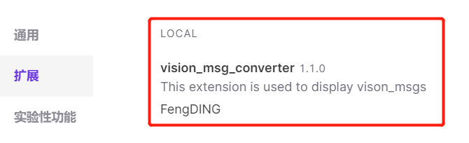

# Foxglove vision msgs plugin

## 1. Description

* Foxglove `create-foxglove-extension` gives a great example about how to display an unsupported message type on foxglove. [https://docs.foxglove.dev/docs/visualization/extensions/introduction/](https://docs.foxglove.dev/docs/visualization/extensions/introduction/). But the doc is not clear about how to display a ROS/ROS2 extended messages, such as, `vision_msgs`, `geometry_msgs`, etc. So with this project I will gives a code example and also the execute pipeline step by step about how to display the ROS vision_msgs by foxglove_plugin. Let's get start.

* Surpose that you are already familiare with craete a foxglove extension, if not check this. [https://github.com/foxglove/create-foxglove-extension](https://github.com/foxglove/create-foxglove-extension)

## 2. How to use

### 2.1. Extensions

* Clone the project `git clone https://github.com/FengD/foxglove_vision_msgs_plugin`
* Install dependencies `npm install`
* Build the package `npm run package`
* After that you will get a file named `fengding.vision_msg_converter-[version].foxe`, drag the file directly to the foxglove opened application. Check the extensions. With the pictures below, it seems that the extension has been added successfully.




### 2.2. db3 file pre-process

* After the 2.1. Since vision_msgs is an extended message in ROS, if it is an unsupported message type in Foxglove, it cannot be directly used through `db3` files. So we need to transform the `db3` file to `mcap` file to render the result.
* Get mcap-cli `wget https://github.com/foxglove/mcap/releases/download/releases%2Fmcap-cli%2Fv0.0.34/mcap-linux-amd64 -O mcap`. Annexe 3.1. gives the command helps.
* `tools` folder contains a compiled useful ros_msgs. Use the command below to finish the transformation.

``` shell
mcap convert mono3d_front120_0.db3 mono3d_front120_0.mcap
failed to convert file: failed to find schema for vision_msgs/msg/Detection3DArray: schema not found
root@fengding:~# mcap convert mono3d_front120_0.db3 mono3d_front120_0.mcap --ament-prefix-path [tools]/ros_msg/
```
* Try the mcap file generated in the Foxglove.


## 3. Annexe

### 3.1. mcap

``` shell
🔪 Officially the top-rated CLI tool for slicing and dicing MCAP files.

Usage:
  mcap [command]

Available Commands:
  add         Add records to an existing MCAP file
  cat         Cat the messages in an MCAP file to stdout
  completion  Generate the autocompletion script for the specified shell
  compress    Create a compressed copy of an MCAP file
  convert     Convert a bag file to an MCAP file
  decompress  Create an uncompressed copy of an MCAP file
  doctor      Check an MCAP file structure
  filter      Copy some filtered MCAP data to a new file
  get         Get a record from an MCAP file
  help        Help about any command
  info        Report statistics about an MCAP file
  list        List records of an MCAP file
  merge       Merge a selection of MCAP files by record timestamp
  recover     Recover data from a potentially corrupt MCAP file
  version     Output version information

Flags:
      --config string   Config file (default is $HOME/.mcap.yaml)
  -h, --help            help for mcap
      --pprof-profile   Record pprof profiles of command execution. Profiles will be written to files mcap-mem.prof, mcap-cpu.prof, and mcap-block.pprof. Defaults to false.
  -v, --verbose         Verbose output

Use "mcap [command] --help" for more information about a command.

```

### 3.2. Videos

* Rviz - [rviz_mono_3d.mp4](sources/rviz_mono_3d.mp4)

* Foxglove - [foxglove_mono_3d.mp4](sources/foxglove_mono_3d.mp4)


### 3.3. Test Files

* tools - [tools](tools/tools.zip)
* db3 - 
* mcap - 


